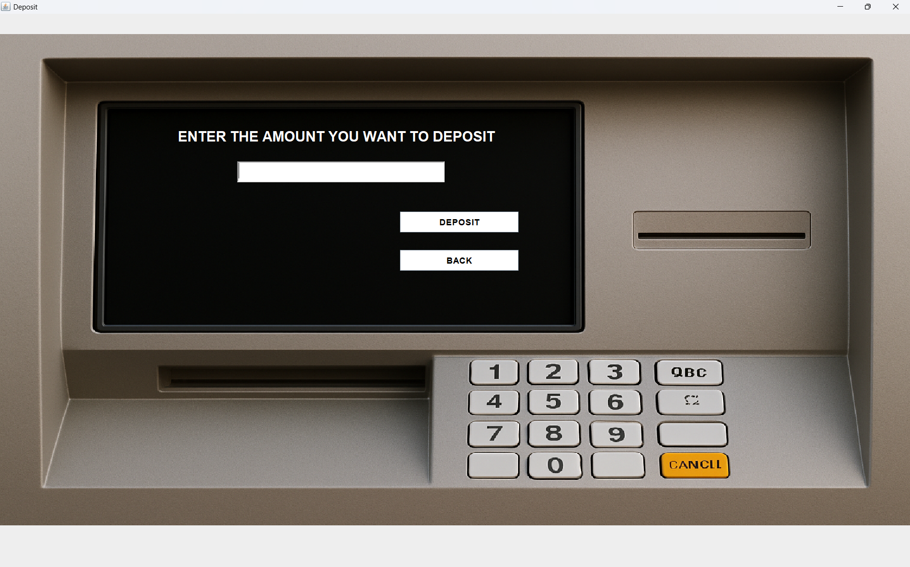

# 🏦 Bank Management System (Java Swing + MySQL)

A **Java Swing–based Bank Management System** that simulates basic banking operations such as account creation, login, deposits, withdrawals, balance enquiry, mini statement, and PIN change.  
This project is ideal for **academic use, learning Java Swing, JDBC, and MySQL integration**, and as a **portfolio project**.

---

## ✨ Features

- 🔐 Secure Login using Card Number & PIN
- 🧾 New Account Registration (Multi-step Signup)
- 💰 Deposit Money
- 💸 Cash Withdrawal
- ⚡ Fast Cash Option
- 📊 Balance Enquiry
- 🧾 Mini Statement
- 🔄 PIN Change
- 🗄️ MySQL Database Integration
- 🖼️ Rich Swing UI with images

---

## 🛠️ Tech Stack

- **Language:** Java (JDK 17+)
- **UI:** Java Swing (AWT)
- **Database:** MySQL
- **Connectivity:** JDBC
- **IDE:** VS Code / IntelliJ / Eclipse

---

## 📁 Project Structure

BankManagementSystem
│
├── src/ # Java source files
│ └── bank/management/system
│
├── bin/ # Compiled .class files
│
├── lib/ # External libraries
│ ├── mysql-connector-java-8.0.28.jar
│ └── jcalendar-tz-1.3.3-4.jar
│
├── screenshots/ # Application screenshots
│ ├── login.png
│ ├── transaction-menu.png
│ ├── mini-statement.png
│ ├── balance-enquiry.png
│ ├── deposit.png
│ └── signup.png
│
├── database.sql # Database schema & sample data
├── run.txt # How to compile and run the project
└── README.md # Project documentation


---

## 🗄️ Database Setup

### Step 1 — Start MySQL Server
Ensure MySQL service is running.

### Step 2 — Import Database
Run:

```bash
mysql -u root -p < database.sql
This will:

Create the database

Create all required tables

Insert a sample login user

Sample Login Credentials
Card Number: 1111222233334444
PIN: 1234
▶️ How to Run the Project
1️⃣ Compile the Project
javac -d bin -cp "lib/*" src/bank/management/system/*.java
2️⃣ Copy Assets
xcopy src\assets bin\assets /E /I
3️⃣ Run the Application
java -cp "bin;lib/*" bank.management.system.Login
📌 Detailed instructions are available in run.txt.

## 🖼️ Application Screenshots

### 🔐 Login Screen
Users enter card number and PIN to access ATM services.


---

### 📋 Transaction Menu
Users can select banking operations.


---

### 🧾 Mini Statement
Displays recent transactions and account balance.


---

### 📊 Balance Enquiry
Shows current account balance.


---

### 💰 Deposit Screen
Users can deposit money into their account.




---

### 📝 Account Registration Form
Multi-step signup form used to create new accounts.


⚠️ Notes
Ensure MySQL is running before starting the application

Update database credentials in Conn.java if needed

This project stores PIN in plain text (educational purpose only)

🔐 Security Disclaimer
This project is built for educational purposes only.

It does NOT include:

PIN hashing

Encryption

Role-based access

Production-grade security

🚀 Future Improvements
PIN hashing & encryption

Admin dashboard

Transaction export

Maven/Gradle build support

REST API backend

Improved UI responsiveness

👨‍💻 Author
Mahesh
Java & Database Enthusiast

⭐ Support
If you like this project, consider giving it a ⭐ on GitHub!
⭐ If you like this project, feel free to star the repository!
